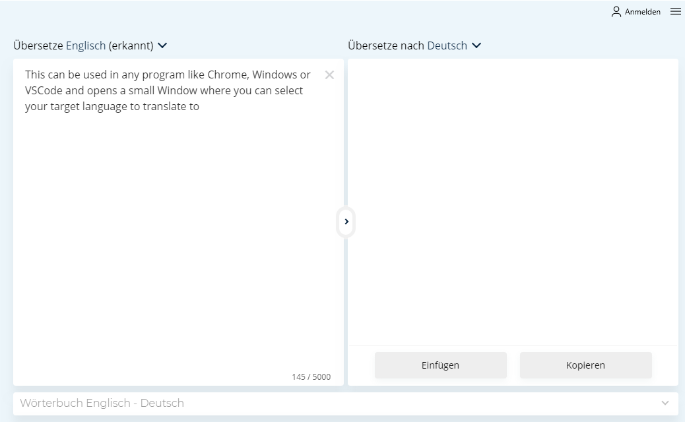
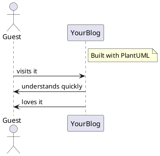

## Why this post

After you have started writing a blog, you will quickly notice your first mistakes: Bad grammar if you are not a native speaker and very often typos. Then it's time to start thinking about how you can get better with the right plugins and be more productive with the right tools - so here we go!

## Code Spell Checker

Typos can happen to everybody and every time, so it's probably a good idea to use a Spell Checker. At first look, this [Code Spell Checker](https://marketplace.visualstudio.com/items?itemName=streetsidesoftware.code-spell-checker) seems to be the most popular - so install it to VSCode and test it for a while :-)

## DeepL plugin

For me and many others [DeepL.com](https://www.deepl.com/translator) is definitely the best translation solution. Let's say something line "next-generation-Google-Translate". And at least for Windows and macOS [a nice plugin is available](https://www.deepl.com/app), which offers you a quick and easy solution for doing translations. Using it on Windows, you simple mark a text to translate and git `CTRL+C+C`. This can be used in any program like Chrome, Windows or VSCode and opens a small Window where you can select your target language to translate to. 

## Enhanced Markdown preview

Some people don't even know that by default a Markdown-Preview is embedded in VSCode (activate it by clicking the button in the upper right corner). Relying a high number of installations and downloads the Plugin [Markdown Preview Enhanced](https://shd101wyy.github.io/markdown-preview-enhanced/#/) might be even better then the default one. I've been using it from the beginning and maybe someone knows the standard preview and knows where the differences are.

Install it using this [link](https://marketplace.visualstudio.com/items?itemName=shd101wyy.markdown-preview-enhanced) to VSCode or search for `markdown-preview-enhanced` in `Extensions`.

## PlantUML

Sometimes pictures say more then thousand words, so just use this easy solution described [in this article](https://www.freecodecamp.org/news/inserting-uml-in-markdown-using-vscode/) to use the PlantUML-Syntax to improve your posts with nice UML-Graphics.



by simple using this little bit of "code"

``` bash
actor Guest
note right of YourBlog: Built with PlantUML
YourBlog <- Guest : visits it
YourBlog -> Guest : understands quickly
YourBlog -> Guest : loves it
```

For a more information about the setup and capabilities of PlantUML just visit the [official page](https://plantuml.com/de/sequence-diagram).

## others

... time to time I'll extend this list with new stuff. Next one will probably be some solution for PlantUML and Hexo/Markdown ...
