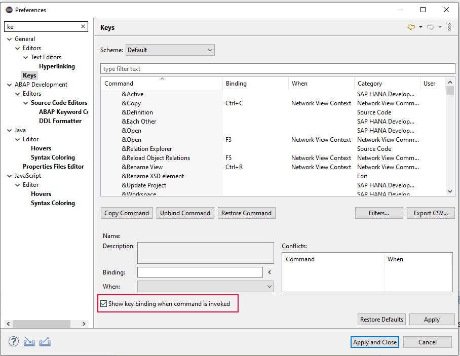
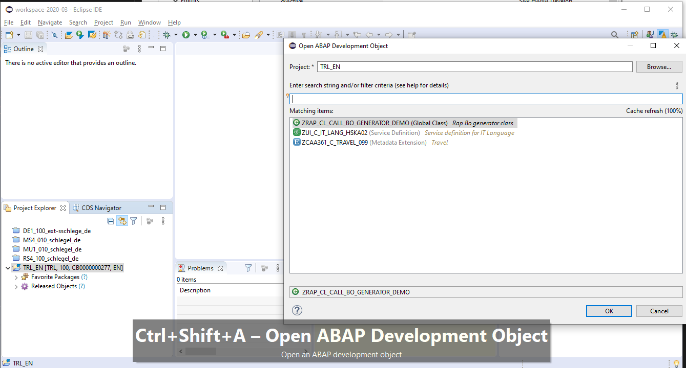
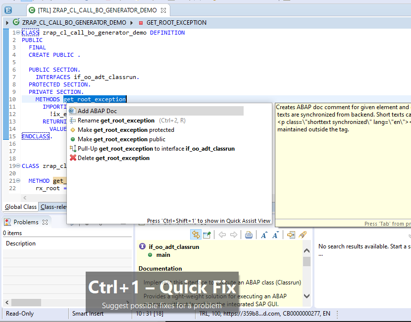
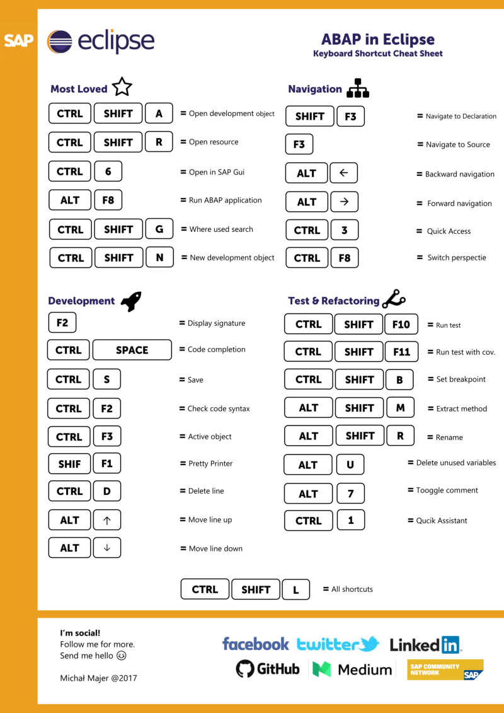

## Why this post

Especially in the world of ABAP Development, Eclipse with [ADT](https://tools.hana.ondemand.com/#abap) is something like a "rising star". After almost 10 years, still a lot of developers don't what to use it, because the still feel more comfortable with SE80. Of of the biggest advantages of Eclipse are the docents of helpful shortcuts. But how to teach them best?

## Show the key bindings

One easy way, is to teach your friends and colleagues them while demonstrating how to use it. But a lot of them are so intuitive, that you simple forget to mention them. [Christian Drumm](https://twitter.com/ceedee666) asked some days ago for the right feature and also [found it](https://twitter.com/ceedee666/status/1261305549427281925?s=20) by himself after some search. You'll find it in Eclipse settings.

.

And with this cool feature activated you can just coding :-) - and your guests can enjoy and learn..

## ADT Cheat Sheet

Besides this feature, it is also possible to learn the shortcuts via the ADT Cheat Sheet.

This picture is originally provided [here](https://blogs.sap.com/2017/07/12/abap-in-eclipse-keyboard-shortcuts-you-cannot-miss-cheat-sheet/) by [Michał Majer](https://people.sap.com/majer.michal).
