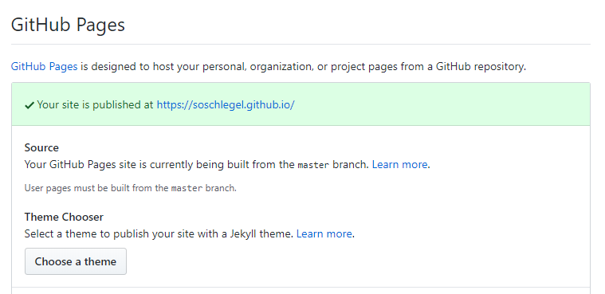

I decided to use [Hexo](https://hexo.io/) for building my building and writing my Blog after a hint of a good friend, because of two reasons:

* I wanted to get more in touch with Markdown
* I like the fact, that it is completely build with Markdown and because of this, it is "Platform-Indepent", what means, that I am always able to move all my content to another solution if I like someday :-)

## GitHub-Pages

The next to think about, is where to host the blog? GitHub is at the moment the cool shit, so let's use GitHub with [GitHub Pages](https://pages.github.com/). The idea behind Pages is to publish nice looking content to your project and repositories, that is better styled then a typical **README.md**

### Kind of Pages

GitHub provides different types of *Pages* that can be typically divided into [User or organization](https://pages.github.com/#user-site) or [Project](https://pages.github.com/#project-site) sites.
So for me, it's a user-site what is easy to establish and all well documented in the official documentation. But the next question for me was: How to bring GitHub and Hexo together?

## Deploy Hexo to GitHub Pages

### Idea behind

Hexo creates a kind of "compiled" HTML-Content, and this is what I want to show the visitors of this page. But I also want to store and version my sources on GitHub, and storing both in a repository is "not so easy" (at least, if you're a complete nooby like me :-P).

### Looking at the official way

In the official documentation of Hexo, there is a section on [how to bringiHexo and GitHub Pages](https://hexo.io/docs/github-pages.html) together, but the described way - at least for my scenario - is a little bit overengineered (using travis) and simply not working, as you can read in [comment section below the article](http://disq.us/p/26aknge). The cooler way: Use Hexo-Deployer, as described on the for private repositories, but tweek it a little bit to achieve your ideal setup.

## Let's start

### Setting up Hexo

Start with installing hexo via terminal like in the [official documentation](https://hexo.io/docs/setup) described

``` bash
$ npm install hexo-cli -g
```

Next init your project

```bash
$ hexo init <folder>
$ cd <folder>
$ npm install
```
Waiting some short moments a you are ready to run :-)

I recommend you to use with some of the cool Plugins for editing your articles (perhaps I'll write a separate post about some time).

### Connecting to GitHub

Next step is to bring our content to GitHub - but not the typical Master-Branch, because we'll need them later for our page itself.

#### Create Repository

First step is to create your repository on GitHub if not already existing. If you want it to be reachable via **https://*username*.github.io**, then you have to create a repository called ***username*.github.io**.

#### Push to Git

We have to switch to the folder of our blog and then execute some commands:

``` bash
git init
git add .
git commit -m "first commit"
git remot add origin git@github.com<<username>>/<<username>>.git
```

Here we stop with the default documentation and create first a new branch, for our hexo sources:

``` bash
git checkout -b hexo_sources
git push origin hexo_sources
```

Now are our sources connected to the new branch and we can use the master-branch for the public content.

#### Deploy your page

The problem with your "User-GitHub-Page" is, that you can only publish the master-branch (using other repositories, you are able to change the branch to be published).


But this is already prepared by us - next step: Use [Hexo-Deployer](https://github.com/hexojs/hexo-deployer-git), what was already announced in the beginng.

Installation is again really easy:

``` bash
$ npm install hexo-deployer-git --save
```

...and all the possible configuration is descibed in the documentation, so in our case it should look like

```yaml
# Deployment
## Docs: https://hexo.io/docs/deployment.html
deploy:
  type: git
  repo: 
    github:
      url: https://github.com/soschlegel/soschlegel.git
      branch: master
```
